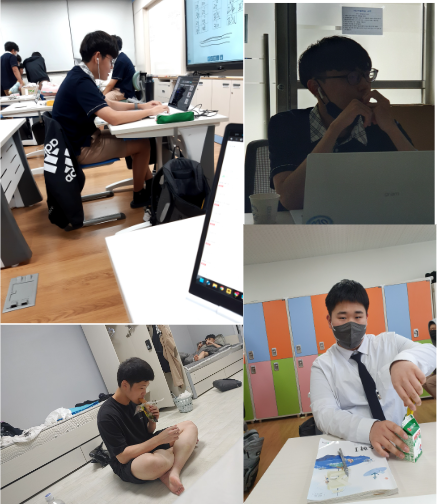
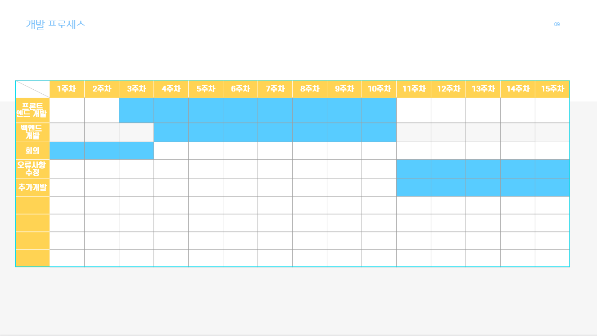
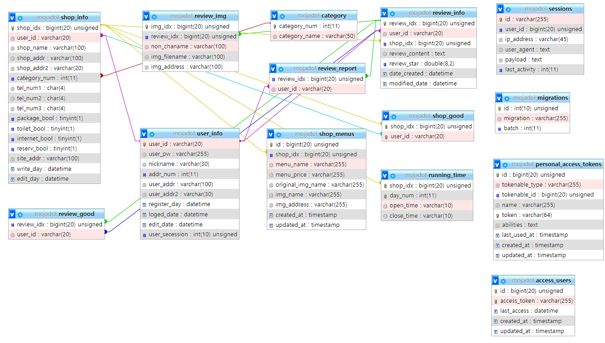

# 프로젝트 개요

  음식점 정보 공유 사이트 [맛집탐색기]에 대한 설명입니다.

## 목차 
* <a href="#프로젝트-개요">프로젝트 개요</a>
  - <a href="#목차">목차</a>
  - <a href="#프로젝트-주제">프로젝트 주제</a>
  - <a href="#개발-동기">개발 동기</a>
  - <a href="#수행-목표">수행 목표</a>
* <a href="#팀-소개">팀 소개</a>
  - <a href="#사진">사진</a>
  - <a href="#이름">이름</a>
* <a href="#사용-기술">사용 기술</a>
  - <a href="#개발에-사용한-기술">개발에 사용한 기술</a>
* <a href="#수행-추진-일정">수행 추진 일정</a>
* <a href="#프로젝트-상세-소개">프로젝트 상세 소개</a>
  - <a href="#레이아웃-세부-설명">레이아웃 세부 설명</a>
  - <a href="#데이터베이스--데이터-플로우--시스템-구조">데이터베이스 / 데이터 플로우 / 시스템 구조</a>
  - <a href="#세부-수행-과정">세부 수행 과정</a>
* <a href="#사용자-수행-흐름도">사용자 수행 흐름도</a>
* <a href="#프로젝트-추진-결과">프로젝트 추진 결과</a>
  - <a href="#결과-분석">결과 분석</a>
  - <a href="#유지-보수">유지 보수</a>
* <a href="#결과-및-발표-자료">결과 및 발표 자료</a>
  - <a href="#깃허브-저장소-주소">깃허브 저장소 주소</a>
  - <a href="#실행-주소">실행 주소</a>
  - <a href="#프로젝트-소개-영상--팀-소개-영상">프로젝트 소개 영상 / 팀 소개 영상</a>
  - <a href="#계획-발표-자료">계획 발표 자료</a>
  - <a href="#중간-발표-자료">중간 발표 자료</a>
  - <a href="#최종-발표-자료">최종 발표 자료</a>

## 프로젝트 주제

  맛집 정보 공유 사이트

## 개발 동기

  여행을 갔을때 맛있는 음식을 먹고싶었지만 정보가 없어서 근처에 있는 음식점을 들어가 먹었지만 맛없었던 경험이 있을것입니다. 
  그런 경험을 바탕으로 저희는 음식점의 리뷰, 상태 또는 정보를 얻고 공유하고 싶은 음식점을 공유하고싶은 사용자들을 위한 사이트 [맛집탐색기]를 만들것입니다.

## 수행 목표

  장기간의 합동 개발을 통해 실무 경험을 쌓고 팀워크 능력을 기르며, 계획한 프로젝트를 완성하는것에 최선을 다하는 것입니다. 
  또한 팀 프로젝트을 함으로써 실질적으로 어떠한 문제점이 생기고 해결하며 이런 과정을 통해 같은 문제가 생겼을때 유연하게  대처할 수 있는 능력을 갖추는 것입니다.

# 팀 소개

## 사진

## 이름

  <a href="https://github.com/reproduce0529">
    (백엔드, 팀장) - singing1111pop@gmail.com
  <a/>

  <a href="https://github.com/mingyu9570">
    박민규(프론트) - renge57439570@gmail.com
  <a/>

  <a href="https://github.com/hanavi999">
    박찬현(프론트) - chanhyeon777@gmail.com
  <a/>

  <a href="https://github.com/shell-by">
    이준환(백엔드) - wnsghks1026@naver.com
  <a/>

# 사용 기술

## 개발에 사용한 기술

# 수행 추진 일정

# 프로젝트 상세 소개
  
## 레이아웃 세부 설명
  
## 데이터베이스 / 데이터 플로우 / 시스템 구조
  
  ### 데이터베이스 / 데이터 플로우
  
  
  ### 시스템 구조
  
  
## 세부 수행 과정
  
  
# 사용자 수행 흐름도
  
  
# 프로젝트 추진 결과
  
  
## 결과 분석
  
  
## 유지 보수
  
  
# 결과 및 발표 자료
  
  
## 깃허브 저장소 주소
<a href="https://github.com/GBSWmojaDol">
  mojadol
</a> 

## 실행 주소
  
  
## 프로젝트 소개 영상 / 팀 소개 영상
  
  
## 계획 발표 자료

  <a href="https://github.com/GBSWmojaDol/mojaDol/blob/master/ReadMe/2022%ED%95%99%EB%85%84%EB%8F%84%20%EA%B2%BD%EB%B6%81%EC%86%8C%ED%94%84%ED%8A%B8%EC%9B%A8%EC%96%B4%EA%B3%A0%20%EC%BA%A1%EC%8A%A4%ED%86%A4%ED%94%84%EB%A1%9C%EC%A0%9D%ED%8A%B8%20%EC%88%98%EC%A0%95%EA%B3%84%ED%9A%8D%EC%84%9C(%EB%AA%A8%EC%9E%90%EB%91%98).hwp">
    계획서
  </a>

  <a href="https://github.com/GBSWmojaDol/mojaDol/blob/master/ReadMe/%EA%B3%84%ED%9A%8D%20%EB%B0%9C%ED%91%9C%20%EC%9E%90%EB%A3%8C.pptx">
    계획 발표 자료
  </a>

  
## 중간 발표 자료

  <a href="https://github.com/GBSWmojaDol/mojaDol/blob/master/ReadMe/%EC%A4%91%EA%B0%84%20%EB%B0%9C%ED%91%9C%20%EC%9E%90%EB%A3%8C.pptx">
    중간 발표 자료
  </a>

  
## 최종 발표 자료
